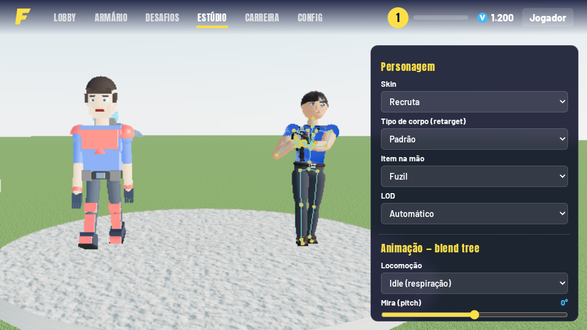
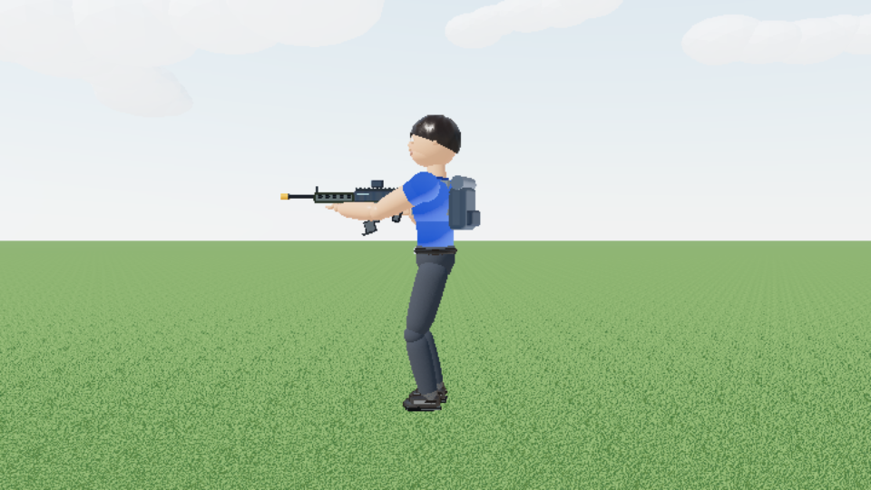
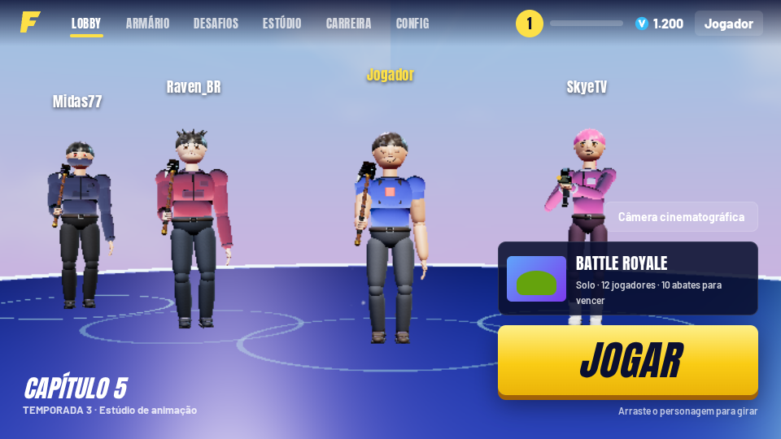
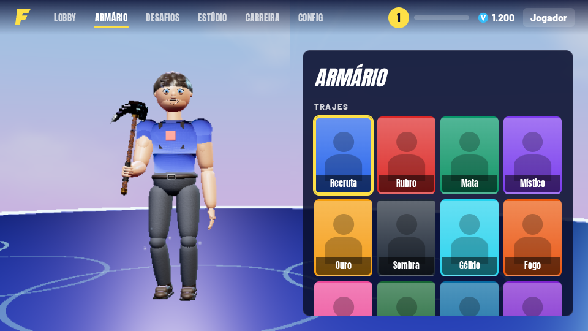
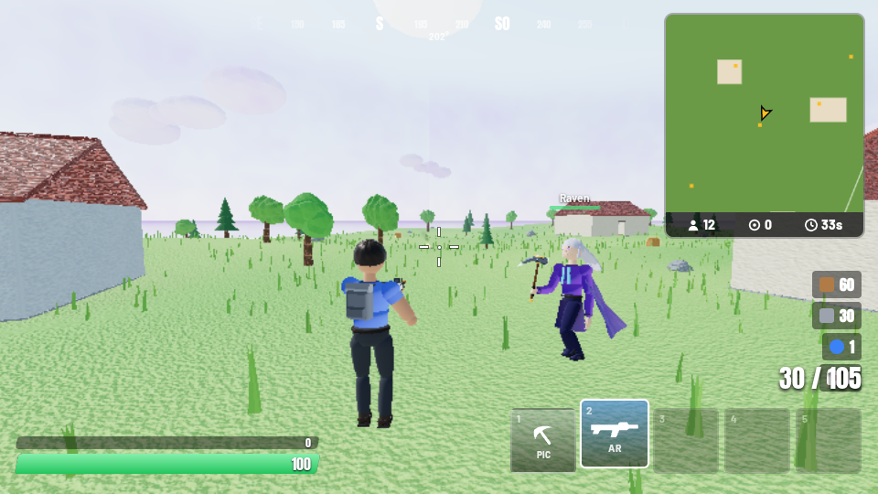

# Comparativo ANTES (v10) × DEPOIS (v11)

O comparativo ao vivo está no Estúdio: basta ativar "Comparar ANTES × DEPOIS", que põe o personagem da v10 (`js/legacy`) lado a lado com o novo, a correr a mesma animação.

## Animação (prioridade máxima)
| Aspeto | ANTES (v10) | DEPOIS (v11) |
|---|---|---|
| Esqueleto | Grupos soltos rodados com seno | 22 ossos hierárquicos + IK de dois ossos (braços/pernas), com FK nos clips |
| Transições | Troca instantânea de estado | Blend tree 2D + crossfade + camadas (tronco superior mascarado, aditiva) |
| Idle | Estático | Respiração, deslocação de peso, micro-movimentos, piscar, olhar |
| Walk/Run | Pernas em pêndulo, pés a deslizar | Ciclos em keyframes com fase sincronizada e foot-planting por IK |
| Armas | Arma "colada" ao corpo, mãos fora do sítio | Mãos presas ao grip e ao foregrip por IK, recoil com mola, recarga com carregador na mão, pump/ferrolho animados |
| Picareta | Rotação simples do braço | Golpe com antecipação, impacto, follow-through e partículas |
| Rosto | Textura fixa | Blend shapes (6 expressões) + visemas de lip sync |
| Física secundária | Nenhuma | Cabelo, capa, mochila e músculos com molas e vento |
| Retargeting | Um único corpo | 4 tipos de corpo, os mesmos clips, com IK a corrigir comprimentos |

 

## Modelos
| Aspeto | ANTES | DEPOIS |
|---|---|---|
| Geometria | Caixas (cerca de 12 por personagem) | Lathe/capsule com edge loops nas articulações, mãos com dedos, 3 LODs |
| Materiais | MeshStandard de cor lisa | PBR: pele (sheen/transmissão), tecido com trama, metal, polímero, vidro |
| Texturas | Nenhuma | Procedurais (albedo, normal, roughness, displacement), de 512 a 2048 px |
| Proporções | Cabeça/tronco em bloco | Proporções estilizadas no estilo Fortnite, com 4 tipos de corpo |

## Preview / render
| Aspeto | ANTES | DEPOIS |
|---|---|---|
| Iluminação | Hemi + direcional | HDRI procedural (PMREM), sombras PCF suaves, GTAO, bloom, ACES, light probe de GI |
| Câmera | Fixa | OrbitControls com damping + câmera cinematográfica (dolly/tracking/shake) |
| Visualização | Só material | Material, sólido, wireframe, normais e "ray-tracing" (SSR) |
| Performance | Sem controlo | Presets de qualidade, resolução dinâmica, LOD, instancing, overlay de FPS (F8) |
| Mira | Por cima do jogador | Câmera sobre o ombro e raycast a partir da câmera, por isso a mira nunca fica no jogador |

## Sistemas novos
Partículas (fogo, fumo, água, magia), física (gravidade, colisões, caixas, detritos, tecidos por molas), GI por light probe, áudio 3D HRTF, IA por utilidade, clima dinâmico (chuva, neve, nevoeiro, trovoada, dia/noite) e câmera cinematográfica.

## Lobby
 

## Partida

## v11 → v12
| Área | v11 | v12 |
|---|---|---|
| Loja | não existia | loja diária, raridades, V-Bucks, experimentar, miniaturas 3D |
| Skins | 12 | 18 (6 novas com capacete, viseira, headphones, chifres, barba, cachecol, moicano, afro, linhas neon) |
| Picaretas | 1 modelo, 2 golpes | 7 modelos, combo de 3 golpes, rastro, faíscas, pontos fracos |
| Queda | queda fixa + planador automático | mergulho/frear/inclinar, abrir manual, abertura com mola, FOV/linhas/tremor, rastros, pousos |
| Sistemas | tempestade, baús, clima | + plataformas de lançamento, entrega aérea, ouro, mercador |
| NPCs | falas aleatórias | conversas em par, copiam emotes, reagem a skins; mercador com lip sync |
| Rato após pausa | preso em modo sem bloqueio (cursor saía da página) | re-bloqueio com "clique para continuar" |

## v12 → v13
| Área | v12 | v13 |
|---|---|---|
| Modos | só Battle Royale | 7 modos: BR, Zero Construção, Blitz, Mata-Mata 6×6, Arsenal, Duelo 1×1, Criativo + mapas criados |
| Criação de mapas | não existia | editor em jogo com 19 objetos, grelha, voo, desfazer, salvar/exportar/importar, testar e jogar |
| Equipas | não existiam | equipas, sem fogo amigo, aliados que seguem, placar, minimapa |
| Draw calls (partida, q=baixa) | ~982 | ~452 (personagens em SkinnedMesh por material, casas fundidas) |
| Casas | paredes, janelas simples | caixilhos, portadas, floreiras, porta com lanterna, telhas, interior mobilado |
| Natureza | rochas lisas, árvores 7 copas, pinheiro 4 camadas | rochas com ruído e musgo, árvores com galhos e 12 copas, pinheiro 6 camadas |

## v13 → v14
| Área | v13 | v14 |
|---|---|---|
| Multijogador | Só local, contra bots | P2P WebRTC: criar sala, salas públicas, código/link, até 8 jogadores + bots, chat, ping |
| Sincronização | — | 15 Hz com interpolação de 100 ms; tiros, dano, mortes, construções, baús, emotes, tempestade e placar sincronizados |
| Pós-processamento | Output + SMAA (média+) | + 1 passe de grading/vinheta/nitidez em todas as qualidades |
| Oceano | MeshPhysical com clearcoat | Standard + cor por profundidade, ondulação e espuma animada (mais barato) |
| Terreno | Cores de vértice simples | Variação macro + encostas de terra, sem custo na GPU |
| Personagens no chão | Só sombra do shadow map (nenhuma em Baixa) | Sombra de contacto sempre, 1 draw call para todos |
| Relva | Cor plana | Gradiente raiz→ponta |

## v14 → v15

| Área | v14 | v15 |
|---|---|---|
| Compilação de shaders | Parte compilava a meio da partida (travadas no 1.º tiro/construção/planador) | Tudo pré-compilado no carregamento |
| Luzes dinâmicas | Criadas quando necessário (recompilação geral) | Pool fixo de 4 luzes |
| Frame de CPU (BR, 12 bots, medição em CPU de teste) | mediana 4.5 ms · p99 34.7 ms · máx 55.7 ms | mediana 2.9 ms · p99 21.8 ms · máx 40.7 ms |
| Céu | Shader por pixel a cada frame | Cubemap refeito só quando o céu muda |
| Articulações | 1 osso por vértice (quebras visíveis) | Mistura suave entre ossos |
| Trajes | 18 | 24 |
| Picaretas / Planadores / Rastros | 7 / 5 / 5 | 11 / 9 / 11 |
| Danças da loja | 3 | 10 |
| Efeito de aterragem | Poeira | Poeira + anel e clarão do rastro |
| Lobby | Degradê + palco simples | Céu com sol/ilhas/mar, ilhas flutuantes, ônibus, palco duplo, feixes |
