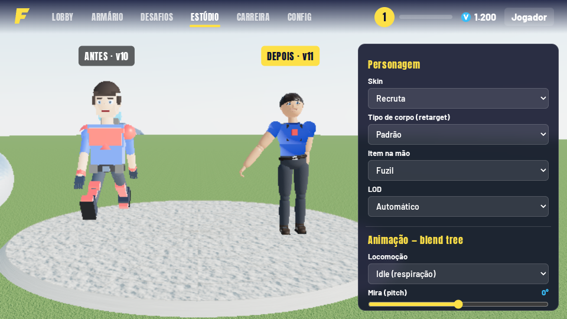

# Comparativo ANTES (v10) × DEPOIS (v11)

O comparativo ao vivo está no Estúdio: basta ativar "Comparar ANTES × DEPOIS", que põe o personagem da v10 (`js/legacy`) lado a lado com o novo, a correr a mesma animação.

## Animação (prioridade máxima)
| Aspeto | ANTES (v10) | DEPOIS (v11) |
|---|---|---|
| Esqueleto | Grupos soltos rodados com seno | 22 ossos hierárquicos + IK de dois ossos (braços/pernas), com FK nos clips |
| Transições | Troca instantânea de estado | Blend tree 2D + crossfade + camadas (tronco superior mascarado, aditiva) |
| Idle | Estático | Respiração, deslocação de peso, micro-movimentos, piscar, olhar |
| Walk/Run | Pernas em pêndulo, pés a deslizar | Ciclos em keyframes com fase sincronizada e foot-planting por IK |
| Armas | Arma "colada" ao corpo, mãos fora do sítio | Mãos presas ao grip e ao foregrip por IK, recoil com mola, recarga com carregador na mão, pump/ferrolho animados |
| Picareta | Rotação simples do braço | Golpe com antecipação, impacto, follow-through e partículas |
| Rosto | Textura fixa | Blend shapes (6 expressões) + visemas de lip sync |
| Física secundária | Nenhuma | Cabelo, capa, mochila e músculos com molas e vento |
| Retargeting | Um único corpo | 4 tipos de corpo, os mesmos clips, com IK a corrigir comprimentos |

 

## Modelos
| Aspeto | ANTES | DEPOIS |
|---|---|---|
| Geometria | Caixas (cerca de 12 por personagem) | Lathe/capsule com edge loops nas articulações, mãos com dedos, 3 LODs |
| Materiais | MeshStandard de cor lisa | PBR: pele (sheen/transmissão), tecido com trama, metal, polímero, vidro |
| Texturas | Nenhuma | Procedurais (albedo, normal, roughness, displacement), de 512 a 2048 px |
| Proporções | Cabeça/tronco em bloco | Proporções estilizadas no estilo Fortnite, com 4 tipos de corpo |

## Preview / render
| Aspeto | ANTES | DEPOIS |
|---|---|---|
| Iluminação | Hemi + direcional | HDRI procedural (PMREM), sombras PCF suaves, GTAO, bloom, ACES, light probe de GI |
| Câmera | Fixa | OrbitControls com damping + câmera cinematográfica (dolly/tracking/shake) |
| Visualização | Só material | Material, sólido, wireframe, normais e "ray-tracing" (SSR) |
| Performance | Sem controlo | Presets de qualidade, resolução dinâmica, LOD, instancing, overlay de FPS (F8) |
| Mira | Por cima do jogador | Câmera sobre o ombro e raycast a partir da câmera, por isso a mira nunca fica no jogador |

## Sistemas novos
Partículas (fogo, fumo, água, magia), física (gravidade, colisões, caixas, detritos, tecidos por molas), GI por light probe, áudio 3D HRTF, IA por utilidade, clima dinâmico (chuva, neve, nevoeiro, trovoada, dia/noite) e câmera cinematográfica.

## Lobby
 

## Partida

